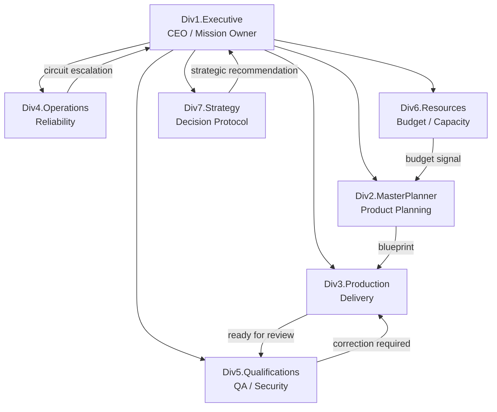

# Handoff: Текущее состояние агентов BOS Light и системные противоречия в Paperclip

Этот документ является итоговым техническим резюме (handoff) для следующего AI-агента или разработчика. В нем зафиксирована текущая картина 7 семантических агентов-отделов, их роли, оргсхема и детальный анализ противоречий их работы внутри экосистемы Paperclip.

---

## 1. Схема подчинения и взаимодействия (Org Chart & Flow)

Все отделы подчинены `Div1.Executive` (CEO). Работа передается горизонтально по цепочке создания ценности:

---

## 2. Подробное описание ролей 7 агентов-отделов (BOS Divisions)

Локальный валидатор шаблона (**[validate_company_template.py](file:///home/qazanik/Documents/BOS_Chimera_Paperclip_Handoff/BOS_Chimera_Paperclip_Handoff/scripts/validate_company_template.py)**) подтверждает структурную целостность пакета. Ниже приведено описание ролей каждого из агентов на основе их профилей `AGENTS.md`.

### [Div1.Executive](file:///home/qazanik/Documents/BOS_Chimera_Paperclip_Handoff/BOS_Chimera_Paperclip_Handoff/agents/Div1_Executive/AGENTS.md) — CEO / Владелец миссии
* **ЦКП (Ценный конечный продукт):** Согласованное направление компании (цели, лимиты рисков).
* **Обязанности:** Поддержание соответствия миссии, первичная фильтрация целей от владельца (Triage), назначение проектирования Div2, утверждение эскалаций для Div7.
* **Входные данные:** Цели компании, нечеткие задачи, кандидаты Betting Table, эскалации бюджетов, сигналы Circuit Breaker.
* **Выходные данные:** Приоритеты, решения о маршрутизации, комментарии в задачах.
* **Ограничения (Guardrails):** Не обходить бюджетные и нативные контроли Paperclip, не заниматься микроменеджментом кода, не скрывать решения от истории задач Paperclip.
* **Маршрутизация:** Проектирование $\rightarrow$ Div2, разработка $\rightarrow$ Div3, процессы $\rightarrow$ Div4, QA $\rightarrow$ Div5, бюджет $\rightarrow$ Div6, стратегия $\rightarrow$ Div7.

### [Div2.MasterPlanner](file:///home/qazanik/Documents/BOS_Chimera_Paperclip_Handoff/BOS_Chimera_Paperclip_Handoff/agents/Div2_MasterPlanner/AGENTS.md) — Планирование и проектирование (Shaping)
* **ЦКП:** Проектирование и готовность задач к циклу (BPI, спецификации, QA-политики).
* **Обязанности:** Расчет бизнес-ценности `piko:bpi-score`, генерация 5-секционных спецификаций (Product Blueprints) через `piko:blueprint-gen`, подготовка Betting Table.
* **Спецификация (5 секций):** Identity, BPI, Acceptance contract, Resources, QA policy.
* **Ограничения (Guardrails):** Не усложнять Blueprint сверх 5 секций для MVP, не одобрять работу самому (только готовить к нативному одобрению Paperclip).

### [Div3.Production](file:///home/qazanik/Documents/BOS_Chimera_Paperclip_Handoff/BOS_Chimera_Paperclip_Handoff/agents/Div3_Production/AGENTS.md) — Разработка и доставка (Build / Delivery)
* **ЦКП:** Выполненная работа, полностью соответствующая спецификации и критериям приемки (UAT).
* **Обязанности:** Реализация задач, фиксация прогресса в задачах Paperclip, передача кода на QA, ранее обнаружение блокеров.
* **Входные данные:** Blueprints, лимиты ресурсов, политики QA.
* **Ограничения (Guardrails):** Не разрабатывать не утвержденные на цикл задачи, не менять бюджеты, не скрывать риски в кодовой базе.

### [Div4.Operations](file:///home/qazanik/Documents/BOS_Chimera_Paperclip_Handoff/BOS_Chimera_Paperclip_Handoff/agents/Div4_Operations/AGENTS.md) — Процессы и надежность (Reliability / Process)
* **ЦКП:** Стабильный поток выполнения, регулярные ритуалы, защита от зацикливания.
* **Обязанности:** Мониторинг жизненного цикла задач, проведение пульсов (Daily Pulse) и ревью (Weekly Review), отслеживание Circuit Breaker, эскалация сбоев.
* **Ограничения (Guardrails):** Не менять приоритет продукта без Div1/Div2, не игнорировать срабатывание предохранителя (эскалировать при `OPEN`).

### [Div5.Qualifications](file:///home/qazanik/Documents/BOS_Chimera_Paperclip_Handoff/BOS_Chimera_Paperclip_Handoff/agents/Div5_Qualifications/AGENTS.md) — QA / Безопасность / Знания
* **ЦКП:** Верифицированная работа (прохождение ворот качества LARS).
* **Обязанности:** Запуск проверочных гейтов `piko:eval-gate` (LARS.Deterministic, LARS.SecurityPolicy, LARS.ArtifactIntegrity, LARS.Budget), фиксация доказательств, возврат брака на доработку (`CORRECTION_REQUIRED`).
* **Ограничения (Guardrails):** Не выпускать код без проверок, не придумывать контроли, которые нельзя автоматизировать или проверить в Paperclip.

### [Div6.Resources](file:///home/qazanik/Documents/BOS_Chimera_Paperclip_Handoff/BOS_Chimera_Paperclip_Handoff/agents/Div6_Resources/AGENTS.md) — Бюджет, ресурсы и емкость
* **ЦКП:** Соответствие стоимости и объемов задач лимитам.
* **Обязанности:** Контроль расходов токенов (`company_token_budget_ref`), предоставление отчетов по лимитам перед приоритизацией задач, эскалация превышения бюджетов.
* **Ограничения (Guardrails):** Не пытаться создать параллельный учет расходов (использовать нативные метрики Paperclip), не обходить контроли Paperclip.

### [Div7.Strategy](file:///home/qazanik/Documents/BOS_Chimera_Paperclip_Handoff/BOS_Chimera_Paperclip_Handoff/agents/Div7_Strategy/AGENTS.md) — Принятие решений и адаптация (OODA/Cynefin)
* **ЦКП:** Высококачественные решения в условиях неопределенности, зафиксированные в истории.
* **Обязанности:** Запуск протокола `piko:decide` при сбоях (Circuit Breaker OPEN, бюджетные эскалации, пересмотр политик), классификация контекста по Cynefin (Clear, Complicated, Complex, Chaotic, Disorder) и OODA loop.
* **Ограничения (Guardrails):** Не превращаться в бюрократический тормоз, не принимать стратегических решений без реальной истории использования (usage traces), не сохранять решения только в кэше плагина.

---

## 3. Матрица маршрутизации и ритуалы

### Правила маршрутизации:
| Тип сигнала / Задачи | Первичный отдел | Вторичный отдел | Примечание |
|---|---|---|---|
| **Нечеткая идея или общая цель** | `Div1.Executive` | `Div2.MasterPlanner` | CEO оценивает целесообразность, затем передает на проектирование |
| **Задача в бэклоге** | `Div2.MasterPlanner` | `Div6.Resources` | Оценка ценности (BPI) + подготовка спецификации |
| **Утвержденная в цикле задача** | `Div3.Production` | `Div4.Operations` | Реализация строго по контракту спецификации |
| **Проверка качества (QA)** | `Div5.Qualifications` | `Div3.Production` | Вынесение вердикта (пройдено / отклонено) |
| **Повторяющиеся сбои в цикле** | `Div4.Operations` | `Div7.Strategy` | Запуск предохранителя после 3 неудачных попыток |
| **Превышение лимита токенов/бюджета** | `Div6.Resources` | `Div1.Executive` | Направление эскалации в нативный бюджет Paperclip |
| **Запутанное/Хаотическое событие** | `Div7.Strategy` | `Div1.Executive` | Подготовка взвешенного решения по OODA + Cynefin |

### Описание ритуалов:
1. **Daily Pulse (Ежедневный пульс):**
   * *Цель:* Фиксация текущей активности без микроменеджмента со стороны человека.
   * *Входные данные:* Новые задачи, задачи в процессе, блокировки, сбои гейтов, алерты предохранителя.
   * *Выход:* Короткий дайджест активности и точечные эскалации при необходимости.
2. **Weekly Review (Еженедельный обзор):**
   * *Цель:* Анализ пропускной способности, зависших задач, расходов токенов, сбоев проверок и стратегических отклонений.
   * *Выход:* Корректирующие действия, возможные стратегические решения от `Div7` и обновление порогов BPI.
3. **Batch Approval Ritual (Цикл пакетных согласований):**
   * *Цель:* Групповое согласование спроектированных задач через Таблицу Ставок (Betting Table) вместо рассмотрения каждой микрозадачи отдельно.

---

## 4. Системные противоречия и нестыковки в экосистеме Paperclip

При переносе семантики BOS на исполнительную среду Paperclip был выявлен ряд противоречий и пробелов безопасности.

### Противоречие А. Входная точка задач (Triage)
* **Проблема:** Согласно **[docs/02_ARCHITECTURE.md](file:///home/qazanik/Documents/BOS_Chimera_Paperclip_Handoff/BOS_Chimera_Paperclip_Handoff/docs/02_ARCHITECTURE.md)**, нечеткие задачи приходят напрямую на разбор к `Div2.MasterPlanner`. Но согласно должностным инструкциям **[AGENTS.md (Div1)](file:///home/qazanik/Documents/BOS_Chimera_Paperclip_Handoff/BOS_Chimera_Paperclip_Handoff/agents/Div1_Executive/AGENTS.md)**, именно `Div1.Executive` принимает решение о целесообразности взятия задачи в работу и делегирует проектирование в Div2.
* **Риск:** Размывание ответственности и обход роли CEO-агента, перегрузка проектировщика неструктурированными запросами на ранних стадиях.

### Противоречие Б. Конфликт рантайма (Дублирование инфраструктуры)
* **Проблема:** Предыдущие версии спецификации (v1.2) предлагали плагину самостоятельно запускать (spawn) процессы выполнения Hermes и GSD-Pi.
* **Риск:** Нарушение изоляции и дублирование функций. Paperclip уже предоставляет среду запуска (`Process/HTTP Adapters`), мониторинг памяти, лимиты времени и логирование. Попытка плагина BOS управлять процессами порождает конфликт контроля.
* **Решение в v1.3:** Агенты выполняются исключительно внутри Paperclip-native адаптеров (`hermes_local` / `gsdpi_local`). Плагин BOS Light является строго семантической надстройкой (анализирует `resultJson` и проставляет теги), не вмешиваясь в рантайм.

### Противоречие В. Уязвимость предохранителя Circuit Breaker при зацикливании
* **Проблема:** Circuit Breaker должен мгновенно реагировать на ошибки выполнения агента. Однако Paperclip SDK может не испускать события завершения выполнения (`agent.run.failed` or `agent.run.finished`) в шину событий плагина.
* **Механизм обхода:** Плагин вынужден использовать периодический опрос (polling) с интервалом в 30 секунд.
* **Риск:** За 30 секунд агент в бесконечном цикле (например, при некорректном вызове внешнего API) успеет совершить десятки запросов к LLM и полностью сжечь весь токен-бюджет компании до того, как предохранитель перейдет в состояние `OPEN`.

### Противоречие Г. Рассинхронизация жизненного цикла (BOS Status Mismatch)
* **Проблема:** Paperclip имеет нативный плоский жизненный цикл задач (около 8 статусов, например, `doing`, `done`). BOS Light использует 16 специфичных статусов `bos_status` (например, `CORRECTION_REQUIRED`, `BETTING_POOL`).
* **Риск:** Семантический разрыв. Пользователь видит в интерфейсе Paperclip статус `doing`, а плагин BOS считает задачу заблокированной на исправлении ошибок. В случае сбоя БД плагина, сопоставить нативный статус Paperclip с детальным BOS-статусом без разбора логов невозможно.
* **Решение:** Хранить BOS-статусы в `issue-scoped state` плагина, но обязательно дублировать их в виде нативных ярлыков (Labels) и записей в комментариях задачи.

### Противоречие Д. Симуляция согласований (Betting Table vs Native Approvals)
* **Проблема:** В плагине BOS Light кнопка "Approve Batch" собирает батч задач. Плагин не должен сам принимать решение об их одобрении в своей локальной памяти.
* **Риск:** Обход встроенных систем безопасности и бюджетов Paperclip.
* **Решение:** Кнопка "Approve Batch" должна генерировать нативные запросы согласования через `ctx.approvals.create`. До получения нативного подтверждения от Paperclip, задачи должны оставаться в статусе `CANDIDATE`. Если нативный механизм согласований недоступен (`unvalidated`), плагин возвращает ошибку и требует ручного перевода задач человеком, запрещая автосогласование в кэше.

---

## 5. Рекомендации для следующего шага разработки (Milestone M002)

1. **Не подтверждать поддержку рантайма без доказательств:** Сохранять все свойства интеграции в файле **[capabilities.paperclip-runtime.json](file:///home/qazanik/Documents/BOS_Chimera_Paperclip_Handoff/BOS_Chimera_Paperclip_Handoff/plugin-bos-light/capabilities.paperclip-runtime.json)** в статусе `unvalidated` до тех пор, пока тесты на реальной песочнице Paperclip не покажут успешный результат.
2. **Провести Spikes (C2 и C3):** Начать фазу тестирования M002 с проверки считывания `company-scoped state` после перезапуска плагина и проверки генерации событий выполнения агентов.
3. **Использовать резервную стратегию кэша:** Считать нативные документы и комментарии задач единственным долговечным источником правды для восстановления состояния компании.
